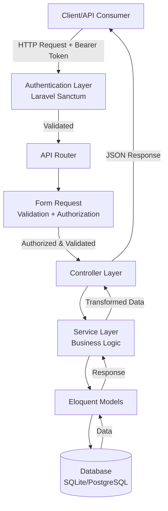
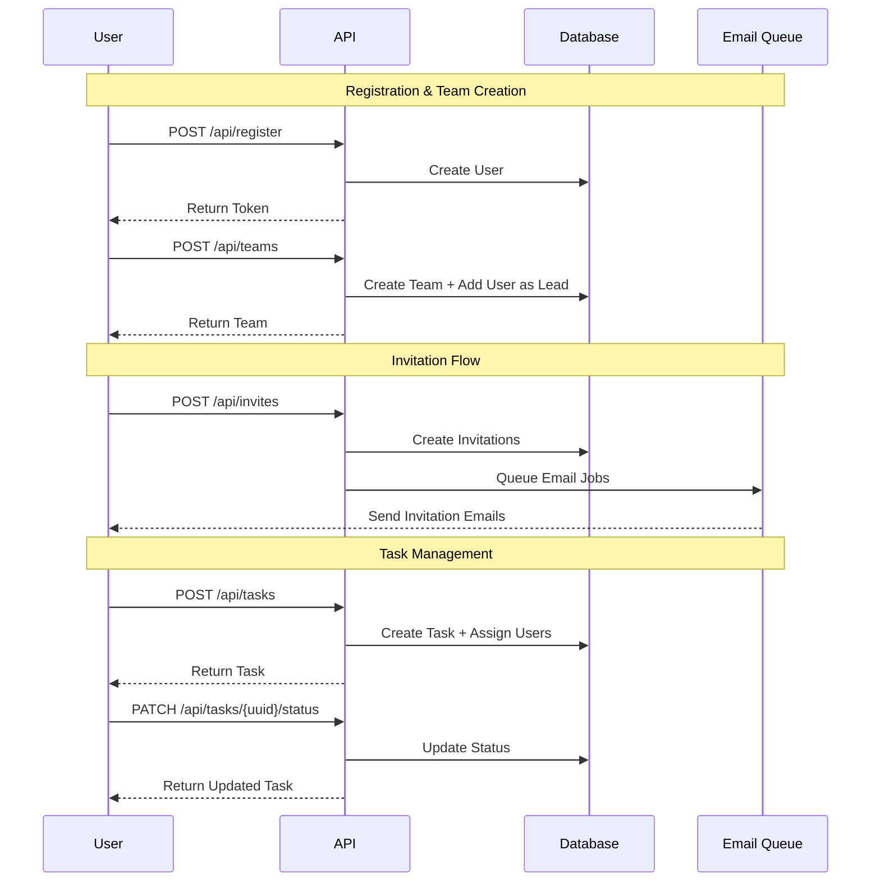
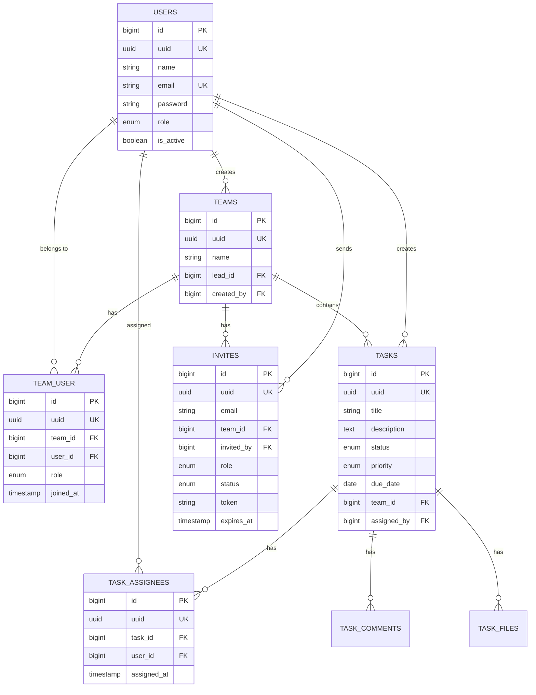
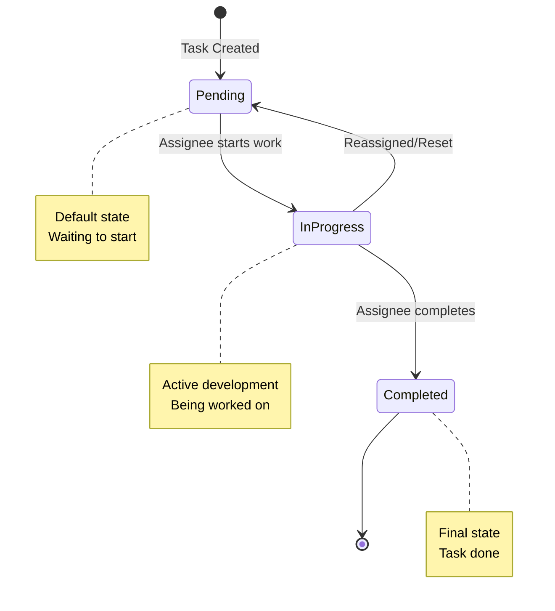

# 🦖 Taskzilla - Technical Specifications

## 📝 Summary

**Taskzilla** is a team-based task management API built with Laravel 12, enabling multi-team collaboration with role-based access control, multi-user task assignment, and email-based team invitations.

**Product Spec:** [View Flow Documentation](./Flows/APPLICATION_FLOW.md)

---

## 📗 Background

### Project Overview
A RESTful API system where users can:
- Create and manage multiple teams
- Invite members via email with role-based permissions
- Create and assign tasks to multiple team members
- Track task progress with statuses and priorities
- Collaborate with comments and file attachments

### Purpose
Provide a secure, scalable backend for task management applications with clean architecture, comprehensive authorization, and production-ready code quality.

### Scope
- **Core Features:** Authentication, Team Management, Task CRUD, Invitations
- **Out of Scope:** Real-time notifications, Mobile apps, Frontend UI
- **Future Considerations:** Task dependencies, Subtasks, Activity logs

---

## ✅ Functional Requirements

### User Stories

**As a User:**
- I can register and login to get an authentication token
- I can create teams and become the team lead
- I can view all teams I belong to

**As a Team Lead:**
- I can invite members via email with specific roles (admin/lead/member)
- I can create tasks and assign them to multiple team members
- I can update/delete tasks in my team
- I can manage team settings

**As a Team Member:**
- I can accept team invitations
- I can view and create tasks in my team
- I can update status of tasks assigned to me
- I can add comments and upload files to tasks

**As an Admin:**
- I have full system access
- I can delete any team
- I can manage any task

### Expected Inputs and Outputs

**Registration:**
- Input: `{name, email, password, password_confirmation}`
- Output: `{user, token}`

**Create Task:**
- Input: `{title, description, team_id, priority, due_date, assignee_ids[]}`
- Output: `{task with relationships}`

**Send Invitation:**
- Input: `{team_id, invitations: [{email, role}]}`
- Output: `{success, results[], summary}`

### User Roles and Permissions

| Role | Scope | Capabilities |
|------|-------|--------------|
| **Admin** | System-wide | Create teams, manage any team/task, delete teams |
| **Lead** | Team-specific | Invite members, create/update/delete tasks, manage team |
| **Member** | Team-specific | View team, create tasks, update assigned task status |

---

## 🏛️ Architecture and Design

### High-Level System Flow



### Application Flow Diagram



### Database ER Diagram



### Task Status State Diagram



---

## ⚙️ APIs

### Authentication Endpoints

| Method | Endpoint | Auth Required | Description |
|--------|----------|---------------|-------------|
| POST | `/api/register` | ❌ | Register a new user account and receive authentication token |
| POST | `/api/login` | ❌ | Login with email/password and receive authentication token |
| POST | `/api/logout` | ✅ | Logout and revoke current authentication token |

---

### Team Management Endpoints

| Method | Endpoint | Auth Required | Description |
|--------|----------|---------------|-------------|
| GET | `/api/teams` | ✅ | List all teams the authenticated user belongs to (paginated) |
| POST | `/api/teams` | ✅ | Create a new team (creator becomes team lead automatically) |
| GET | `/api/teams/{uuid}` | ✅ Team Member | View team details including members, tasks, and statistics |
| PUT | `/api/teams/{uuid}` | ✅ Lead/Admin | Update team name and settings |
| DELETE | `/api/teams/{uuid}` | ✅ Admin Only | Delete a team and all associated data |

---

### Task Management Endpoints

| Method | Endpoint | Auth Required | Description |
|--------|----------|---------------|-------------|
| GET | `/api/tasks/team/{teamId}` | ✅ Team Member | List all tasks for a specific team with filtering and sorting |
| GET | `/api/tasks/my-tasks` | ✅ | Get all tasks assigned to the authenticated user across all teams |
| POST | `/api/tasks` | ✅ Team Member | Create a new task in a team with optional assignees |
| GET | `/api/tasks/{uuid}` | ✅ Team Member/Assignee | View detailed task information including comments and files |
| PUT | `/api/tasks/{uuid}` | ✅ Lead/Creator | Update task details (title, description, priority, due date) |
| PATCH | `/api/tasks/{uuid}/status` | ✅ Lead/Assignee | Update only the task status (pending/in_progress/completed) |
| DELETE | `/api/tasks/{uuid}` | ✅ Lead/Admin | Delete a task and all associated data |
| POST | `/api/tasks/{uuid}/assign` | ✅ Lead/Creator | Assign one or more users to a task |
| POST | `/api/tasks/{uuid}/remove-assignees` | ✅ Lead/Creator | Remove one or more users from a task |
| GET | `/api/tasks/team/{teamId}/statistics` | ✅ Team Member | Get task statistics for a team (total, by status, overdue, etc.) |

---

### Invitation Endpoints

| Method | Endpoint | Auth Required | Description |
|--------|----------|---------------|-------------|
| POST | `/api/invites` | ✅ Lead/Admin | Send email invitations to join a team with specified roles |
| POST | `/api/invites/accept` | ✅ | Accept a team invitation using the token from email |
| GET | `/api/invites/my-pending` | ✅ | Get all pending invitations for the authenticated user |
| GET | `/api/invites/team/{teamId}` | ✅ Lead/Admin | Get all invitations for a specific team |
| DELETE | `/api/invites/{inviteId}` | ✅ Inviter | Revoke a pending invitation |

---

### Common Query Parameters

**Pagination:**
- `per_page`: Number of items per page (1-100, default: 10)

**Task Filtering:**
- `status`: Filter by status (pending|in_progress|completed)
- `priority`: Filter by priority (low|medium|high)
- `assigned_to`: Filter by assignee user ID
- `assigned_by`: Filter by creator user ID
- `team_id`: Filter by team ID
- `overdue`: Show only overdue tasks (true|false)
- `due_soon`: Show tasks due in next 7 days (true|false)

**Sorting:**
- `sort_by`: Sort field (created_at|due_date|priority|status|title)
- `sort_order`: Sort direction (asc|desc)

---

### HTTP Status Codes

| Code | Meaning |
|------|---------|
| 200 | Success - Request completed successfully |
| 201 | Created - Resource created successfully |
| 400 | Bad Request - Invalid request format |
| 401 | Unauthorized - Authentication required or invalid token |
| 403 | Forbidden - User lacks permission for this action |
| 404 | Not Found - Resource does not exist |
| 422 | Validation Error - Input validation failed |
| 500 | Server Error - Internal server error occurred |

---

## Validation Rules

### User Registration
- `name`: string, min:3, max:255, required
- `email`: string, email, unique:users, required
- `password`: string, min:8, confirmed, required

### Team Creation/Update
- `name`: string, min:3, max:255, required

### Task Creation/Update
- `title`: string, min:3, max:255, required
- `description`: string, max:5000, nullable
- `status`: enum (pending|in_progress|completed), nullable
- `priority`: enum (low|medium|high), nullable
- `due_date`: date, after_or_equal:today, nullable
- `team_id`: integer, exists:teams, required (on create)
- `assignee_ids`: array, nullable
- `assignee_ids.*`: integer, exists:users

### Invitation
- `team_id`: integer, exists:teams, required
- `invitations`: array, min:1, max:50, required
- `invitations.*.email`: email, required
- `invitations.*.role`: enum (admin|lead|member), required
- `token`: string, size:64, required (on accept)

---

## Database Schema / Migrations

### Tables Created

1. **users** - User accounts
   - Fields: id, uuid, name, email, password, role, is_active
   - Indexes: uuid, email
   
2. **teams** - Team entities
   - Fields: id, uuid, name, lead_id, created_by
   - Indexes: uuid, lead_id, created_by
   - Foreign Keys: lead_id→users, created_by→users
   
3. **team_user** - Team membership (pivot)
   - Fields: id, uuid, team_id, user_id, role, joined_at
   - Indexes: team_id, user_id, uuid
   - Unique: (team_id, user_id)
   - Foreign Keys: team_id→teams, user_id→users (cascade delete)
   
4. **tasks** - Task records
   - Fields: id, uuid, title, description, status, priority, due_date, team_id, assigned_by
   - Indexes: uuid, status, priority, due_date, team_id, assigned_by
   - Foreign Keys: team_id→teams, assigned_by→users (cascade delete)
   
5. **task_assignees** - Task assignments (pivot)
   - Fields: id, uuid, task_id, user_id, assigned_at
   - Indexes: task_id, user_id, uuid
   - Unique: (task_id, user_id)
   - Foreign Keys: task_id→tasks, user_id→users (cascade delete)
   
6. **task_comments** - Task comments
   - Fields: id, uuid, task_id, user_id, content
   - Foreign Keys: task_id→tasks, user_id→users (cascade delete)
   
7. **task_files** - Task file attachments
   - Fields: id, uuid, task_id, uploaded_by, filename, filepath, filesize, mimetype
   - Foreign Keys: task_id→tasks, uploaded_by→users (cascade delete)
   
8. **invites** - Team invitations
   - Fields: id, uuid, team_id, email, invited_by, role, token, status, expires_at, accepted_at
   - Indexes: uuid, token, email, status
   - Foreign Keys: team_id→teams, invited_by→users (cascade delete)
   
9. **personal_access_tokens** - Sanctum tokens
   - Laravel Sanctum default structure

---

## Models and Relationships

### User Model
- **Has Many:** Teams (as creator), Tasks (as creator), Invites (as inviter)
- **Belongs To Many:** Teams (via team_user pivot), Tasks (via task_assignees)

### Team Model
- **Belongs To:** Lead (User), Creator (User)
- **Belongs To Many:** Users (via team_user)
- **Has Many:** Tasks, Invites, TeamUsers

### Task Model
- **Belongs To:** Team, AssignedBy (User)
- **Belongs To Many:** Assignees (Users via task_assignees)
- **Has Many:** Comments, Files

### Invite Model
- **Belongs To:** Team, Inviter (User)
- **Scopes:** pending(), expired(), forTeam(), forEmail()

### TaskComment Model
- **Belongs To:** Task, User

### TaskFile Model
- **Belongs To:** Task, UploadedBy (User)

---

## Business Logic / Services

### TeamService
- `getUserTeams()` - Get paginated teams for user
- `createTeam()` - Create team with transaction (team + add creator as lead)
- `getTeamDetails()` - Load team with members, tasks, statistics
- `updateTeam()` - Update team details
- `deleteTeam()` - Delete team with transaction (detach members first)

### TaskService
- `getTeamTasks()` - Get filtered/sorted tasks for team
- `getUserTasks()` - Get tasks assigned to user
- `createTask()` - Create task with transaction (task + assign users)
- `getTaskDetails()` - Load task with all relationships
- `updateTask()` - Update task fields
- `updateTaskStatus()` - Update only status field
- `deleteTask()` - Delete task with transaction (detach assignees first)
- `assignUsers()` - Assign users to task (sync without detaching)
- `removeUsers()` - Remove users from task
- `getTaskStatistics()` - Calculate team statistics

### InviteService
- `sendInvitations()` - Process bulk invitations with validation
- `acceptInvitation()` - Accept invite with transaction (add to team + update invite)
- `revokeInvitation()` - Revoke pending invitation
- `getTeamInvitations()` - Get invitations for team
- `getUserInvitations()` - Get invitations for user

---

## Authorization / Policies

### Access Control Implementation
- **Mechanism:** Laravel Gates defined in `TeamGates` and `TaskGates`
- **Location:** `app/AccessControl/Gates/`
- **Enforcement:** FormRequest `authorize()` method checks gates before validation

### Team Gates
| Gate | Logic |
|------|-------|
| `create-team` | Always true (any authenticated user) |
| `view-team` | User is team member |
| `update-team` | User is team lead OR admin |
| `delete-team` | User is admin only |

### Task Gates
| Gate | Logic |
|------|-------|
| `create-task` | User is member of the team |
| `view-task` | User is team member OR task assignee |
| `update-task` | User is admin OR team lead OR task creator |
| `delete-task` | User is admin OR team lead |
| `update-task-status` | User is admin OR team lead OR task assignee |
| `manage-task-assignees` | User is admin OR team lead OR task creator |

---

## Caching Strategy

### Current Implementation
- **Status:** Not implemented (MVP phase)

### Future Considerations
- Cache user's teams list (invalidate on team create/join/leave)
- Cache task statistics (invalidate on task status change)
- Cache team member list (invalidate on member add/remove)

**Invalidation Rules:**
- Clear team cache when: team updated, member added/removed
- Clear task cache when: task created/updated/deleted
- Use Redis for production caching

---

## Notifications / Events

### Email Notifications (Implemented)
- **Team Invitation Email**
  - Trigger: When invitation sent via `POST /api/invites`
  - Mailable: `TeamInviteMail` (implements `ShouldQueue`)
  - Template: `resources/views/emails/team-invite.blade.php`
  - Queue: Background processing via Laravel Queue

### Welcome Email (Implemented)
- **New User Welcome**
  - Trigger: User registration
  - Mailable: `WelcomeMail`
  - Template: `resources/views/emails/welcome.blade.php`

### Future Events/Listeners
- TaskAssigned → Send notification to assignees
- TaskStatusChanged → Notify task creator
- TaskOverdue → Send reminder email
- InvitationAccepted → Notify team lead

---

## Queues / Jobs

### Current Configuration
- **Driver:** Database queue (default)
- **Connection:** `QUEUE_CONNECTION=database`
- **Table:** `jobs` table for queue, `failed_jobs` for failures

### Queued Jobs
- **Email Sending:** All emails sent via queue (implements `ShouldQueue`)
- **Retry Policy:** 3 attempts with exponential backoff
- **Timeout:** 60 seconds per job

### Running Queue Worker
```bash
php artisan queue:work
# or
php artisan queue:listen --tries=3
```

---

## Monitoring/Logs

### Logging Configuration
- **Enabled:** Yes
- **Driver:** Stack (multiple channels)
- **Default Channel:** `LOG_CHANNEL=stack`
- **Log Level:** `LOG_LEVEL=debug`

### Log Storage
- **Location:** `storage/logs/laravel.log`
- **Rotation:** Daily rotation (configurable)
- **Retention:** 14 days default

### What Gets Logged
- All exceptions and errors
- Failed authentication attempts
- Failed queue jobs
- Database query errors (in debug mode)
- Custom business logic errors in controllers/services

### Monitoring Tools (Production Ready)
- Laravel Pail (real-time log viewing)
- Laravel Horizon (for Redis queue monitoring - when using Redis)
- Error tracking: Integrate Sentry/Bugsnag for production

---

## Testing Strategy

### Test Structure
- **Location:** `tests/Feature/` and `tests/Unit/`
- **Framework:** Pest PHP (Laravel's recommended testing framework)

### Test Coverage Target
- **Minimum:** 70% code coverage
- **Critical Paths:** 100% coverage (auth, payments if added, data deletion)

### What to Test

**Unit Tests:**
- Service layer methods
- Model relationships
- Enum values
- Helper functions

**Feature Tests:**
- All API endpoints
- Authorization gates
- Validation rules
- Database transactions

### Mocking Strategy
- Mock external APIs (email services in tests)
- Mock file storage (use fake disk)
- Mock queue (use fake queue for testing)

### Running Tests
```bash
php artisan test
php artisan test --coverage
php artisan test --parallel
```

---

## Security Concerns

### Implemented Security Measures

1. **Authentication:**
   - Laravel Sanctum token-based authentication
   - Passwords hashed with bcrypt
   - Tokens stored hashed in database

2. **Authorization:**
   - Gate-based authorization on every protected endpoint
   - Role-based access control (RBAC)
   - Team-scoped data access

3. **Input Validation:**
   - Comprehensive FormRequest validation
   - SQL injection protection (Eloquent ORM)
   - XSS protection (Laravel's built-in escaping)

4. **Data Security:**
   - UUID-based routes (non-sequential IDs)
   - Foreign key constraints
   - Cascade delete relationships

5. **CORS Protection:**
   - Configurable CORS policies
   - Whitelist allowed origins

6. **Rate Limiting:**
   - Laravel Sanctum built-in rate limiting
   - Configurable per route group

7. **Sensitive Data:**
   - Environment variables for secrets (.env)
   - Passwords never returned in API responses
   - Token plaintext only shown once on creation

### Additional Recommendations
- Enable 2FA for admin accounts (future)
- Implement API rate limiting per user
- Add audit logging for sensitive operations
- Regular security dependency updates
- Use HTTPS in production (enforce SSL)

---

## 📈 Performance Considerations

### N+1 Query Prevention
- **Implementation:** Eager loading with `with()` on all list endpoints
- **Example:** Tasks loaded with assignees, team, comments in single query

### Database Indexing
- **Indexes Added:**
  - UUID columns (unique)
  - Foreign keys (team_id, user_id, etc.)
  - Status, priority columns for filtering
  - Due date for overdue queries
- **Composite Indexes:** (team_id, user_id) on pivot tables

### Query Optimizations
- Use `select()` to limit columns
- Use `withCount()` instead of loading full relationships for counts
- Pagination on all list endpoints (default 10, max 100)
- Conditional eager loading based on need

### File Storage
- AWS S3 for file storage (keeps app servers stateless)
- Signed URLs for secure file access
- File size limits enforced in validation

### Future Optimizations
- Redis caching for frequently accessed data
- Database query caching
- API response caching with ETags
- Background job processing for heavy operations

---

## ⚠️ Risk

| Risk | Impact | Mitigation |
|------|--------|------------|
| **Invitation Token Exposure** | High | Tokens expire in 7 days, one-time use, 64-char random |
| **Mass Assignment Vulnerability** | Medium | Strict `$fillable` arrays on all models |
| **Unauthorized Data Access** | High | Gate authorization on every endpoint |
| **Database Connection Limits** | Medium | Use connection pooling, queue heavy operations |
| **Email Delivery Failures** | Low | Queue system with retry logic, failed job tracking |
| **File Upload Abuse** | Medium | File size limits, mime type validation, S3 storage |

---

## 🧪 Test Plan

### Phase 1: Unit Tests
- ✅ Test all service methods
- ✅ Test model relationships
- ✅ Test validation rules
- ✅ Test helper functions

### Phase 2: Feature Tests
- ✅ Test authentication flow (register, login, logout)
- ✅ Test team CRUD operations
- ✅ Test task CRUD operations
- ✅ Test invitation system
- ✅ Test authorization gates
- ✅ Test error handling

### Phase 3: Integration Tests
- Test complete user workflows
- Test multi-user scenarios
- Test concurrent operations
- Test queue processing

### Phase 4: Performance Tests
- Load testing with 1000+ concurrent users
- Query performance benchmarking
- API response time targets (<200ms)

---

## 🐛 Bug Tracking

### System
- **GitHub Issues:** Primary bug tracking
- **Labels:** bug, enhancement, security, performance
- **Priority:** P0 (critical), P1 (high), P2 (medium), P3 (low)

### Bug Report Template
```
**Environment:** Production/Staging/Development
**Endpoint:** POST /api/tasks
**Expected:** Task created successfully
**Actual:** 500 error returned
**Steps to Reproduce:**
1. Login as user
2. Call endpoint with payload
3. Observe error
**Logs:** [Attach relevant logs]
```

---

## ⏳ Project Timeline

### ✅ Milestone 1: MVP (Completed)
- User authentication (register, login, logout)
- Team CRUD operations
- Basic task management
- **Completion:** January 18, 2026

### ✅ Milestone 2: Advanced Features (Completed)
- Multi-user task assignment
- Email invitation system
- Task filtering and statistics
- File attachment support
- **Completion:** January 20, 2026

### 🚧 Milestone 3: Enhancements (In Progress)
- Real-time notifications
- Task comments system enhancement
- Activity audit logs
- Advanced search and filtering
- **Target:** February 15, 2026

### 📅 Milestone 4: Production Ready
- Comprehensive test coverage (>80%)
- Performance optimization
- Security audit
- API documentation (Swagger/OpenAPI)
- **Target:** March 1, 2026

### 📅 Milestone 5: Scale & Polish
- Redis caching implementation
- Elasticsearch for advanced search
- WebSocket for real-time updates
- Mobile app support enhancements
- **Target:** April 1, 2026

---

## 📚 Tech Stack

### Backend
- **Framework:** Laravel 12.x
- **PHP Version:** 8.2+
- **Architecture:** Clean Architecture (Controller → Service → Model)

### Database
- **Development:** SQLite
- **Production:** PostgreSQL 15+
- **ORM:** Eloquent

### Authentication
- **Library:** Laravel Sanctum 4.x
- **Method:** Token-based authentication
- **Token Storage:** personal_access_tokens table

### File Storage
- **Default:** Local filesystem
- **Production:** AWS S3
- **Library:** league/flysystem-aws-s3-v3

### Email
- **Default:** Log driver (development)
- **Production:** SMTP/Mailgun/SES
- **Queue:** Database queue

### Additional Packages
- **Avatar Generation:** laravolt/avatar
- **Image Processing:** intervention/image
- **Testing:** pestphp/pest

---

## 🚀 Quick Start

```bash
# Clone repository
git clone https://github.com/yourusername/taskzilla.git
cd taskzilla

# Install dependencies
composer install

# Environment setup
cp .env.example .env
php artisan key:generate

# Configure database in .env
DB_CONNECTION=sqlite
DB_DATABASE=database/database.sqlite

# Run migrations
php artisan migrate

# Start development server
php artisan serve

# Start queue worker (separate terminal)
php artisan queue:work

# Run tests
php artisan test
```

---

## 📞 Additional Resources

- **API Documentation:** See TASK_CRUD_DOCUMENTATION.md
- **Flow Diagrams:** See /Flows/ directory
- **Postman Collection:** Import `Taskzilla_API_Complete.postman_collection.json`
- **Database Schema:** See database_schema.dbml

---

**Last Updated:** January 20, 2026  
**Version:** 2.0  
**Maintained By:** Taskzilla Development Team
